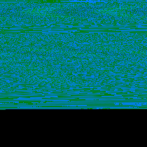

# Audio to image (PNG) for Convolutional Neural Network training

The goal of this project is to train a convolutional network with images of sounds, an image is an array of audio bits represented by RGB colors.

- Question 1: Is an image based convolutional network able to predict / generate speech regardless of things like accent?
- Question 2: Is an image based convolutional network able to predict / generate sounds (like: drum stick, cow, etcetera)?

- Goal 1: recognize the sounds (method: unknown yet).
- Goal 2: synthesize sounds (method: StackGAN).

- Note I: A sound can be anything, in this example spoken word is used in the from of nouns.
- Note II: For now the software handles 16bit, 44khz, mono (single channel) files with a max of one second (= 44100 samples).
- Note III: This is an experiment, any form of feedback is [welcome](https://twitter.com/bobvanluijt)

## Running examples

From WAV to PNG

`$ python convertWavToPng.py input-wav/battle.wav output.png`

from PNG to WAV

`$ python convertPngToWav.py output.png output.wav`

## Step I: Audio to PNG

Every sample is converted into an RBG value.

1. Sample rate 16bit = −32,768 to +32,767
2. Sample rate converted in positive integers: `sample rate + 32768
3. Sample rate converted into hex color
4. Hex color converted into RGB value.
5. Pixel is set to RBG color.
6. Pixel is set on a `math.sqrt( 44100 )` frame (210x210)

File: [convertWavToPng.py](convertWavToPng.py)

## Step II: PNG to audio

Step one is reversed, every pixel is converted into a sample rate.

File: [convertPngToWav.py](convertPngToWav.py)

## Results:

| Noun | Audio Input | Converted PNG  | Reverted Audio |
| ------------- | ------------- | ----- | ----- |
| Battle | [WAV](input-wav/battle.wav) |  | [WAV](output-wav/battle.wav) |
| Broker | [WAV](input-wav/broker.wav) |  | [WAV](output-wav/broker.wav) |
| Calculator | [WAV](input-wav/calculator.wav) |  | [WAV](output-wav/calculator.wav) |
| Cloth | [WAV](input-wav/cloth.wav) |  | [WAV](output-wav/cloth.wav) |
| Collection | [WAV](input-wav/collection.wav) |  | [WAV](output-wav/collection.wav) |
| Guy | [WAV](input-wav/guy.wav) |  | [WAV](output-wav/guy.wav) |
| Lyric | [WAV](input-wav/lyric.wav) |  | [WAV](output-wav/lyric.wav) |
| Miscommunication | [WAV](input-wav/miscommunication.wav) |  | [WAV](output-wav/battle.wav) |
| Protocol | [WAV](input-wav/protocol.wav) |  | [WAV](output-wav/protocol.wav) |
| Trainer | [WAV](input-wav/trainer.wav) |  | [WAV](output-wav/trainer.wav) |

## Training model

_To Do_

## StackGAN model

_To Do_
